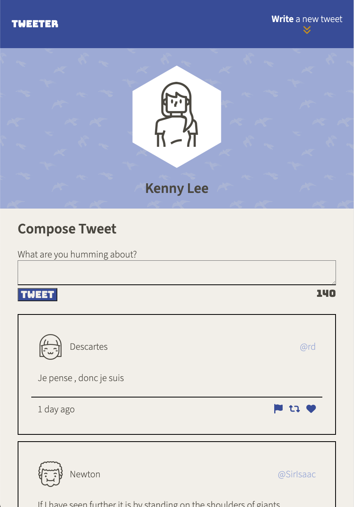
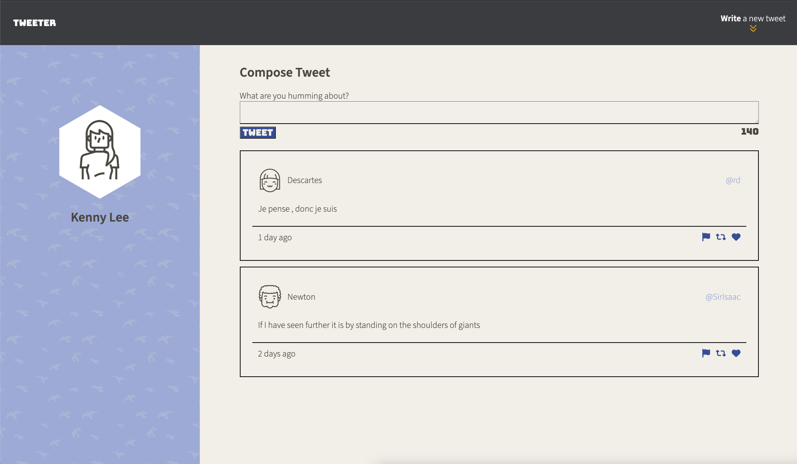

# Tweeter Project

Tweeter is a simple, single-page Twitter clone.

This project was built on a starter repository with server-side code pre-written. It provided practice for responsive design using HTML and CSS, and client-side javascript (including form handling, serialization, XSS, jQuery).

Tweets are stored in a database and displayed new-to-old. Users are able to write simple (140 char max) tweets that will be displayed in the feed. Project includes form error handling for invalid tweets and a responsive layout that changes with the screen size.

## Responsive Interface

### Mobile / Tablet Layout

### Desktop Layout

## Getting Started

1. Clone the repository onto your local device.
2. Install dependencies using the `npm install` command.
3. Start the web server using the `npm run local` command. The app will be served at <http://localhost:8080/>.
4. Go to <http://localhost:8080/> in your browser.

## Dependencies

- Express
- Node 5.10.x or above
- body-parser
- chance
